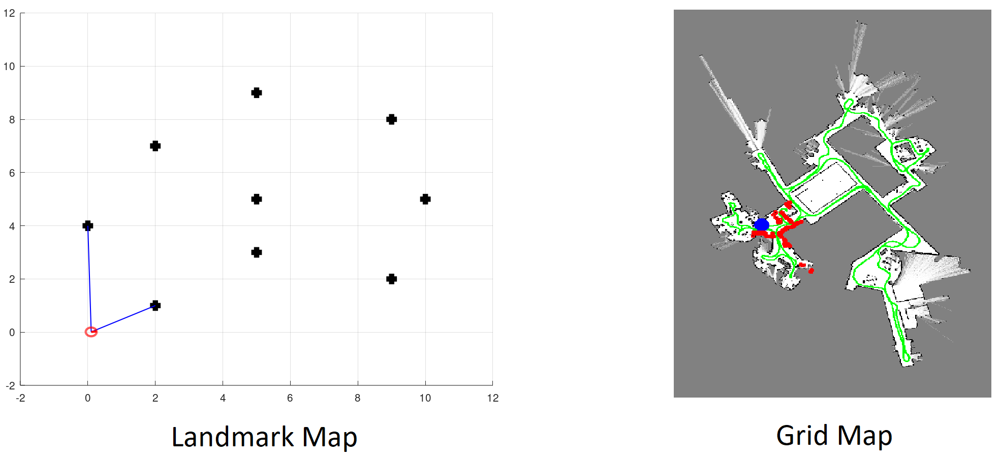
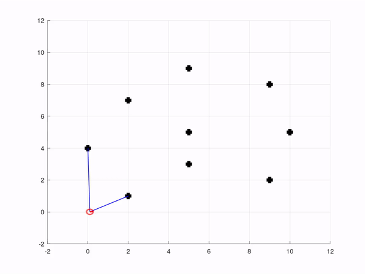
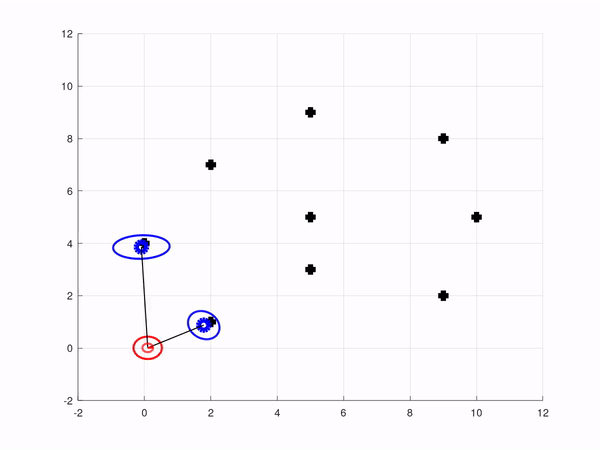
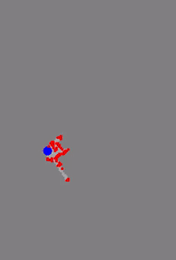
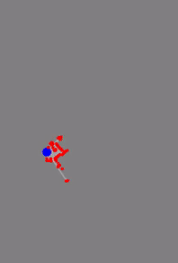
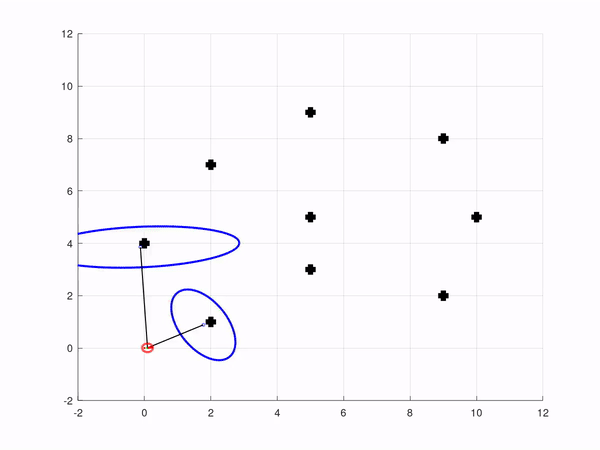
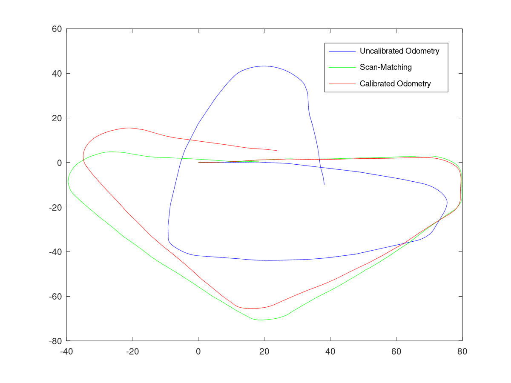
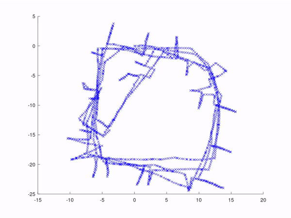
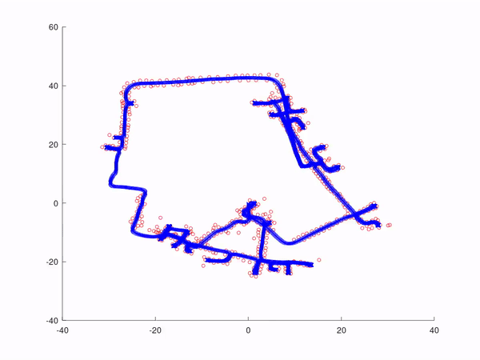

# Simultaneous Localization and Mapping (SLAM)

Simultaneous Localization and Mapping **(SLAM)** is an important problem in robotics aimed at solving the chicken-and-egg problem of figuring out the map of the robot's environment while at the same time trying to keep track of it's location in that environment. There are multiple methods of solving the SLAM problem, with varying performances. This repository aims to provide a backbone for some approaches to SLAM. This repository was a result of following [Prof. Cyrill Stachniss'](http://www.informatik.uni-freiburg.de/~stachnis) lectures from this [YouTube playlist](https://www.youtube.com/watch?v=U6vr3iNrwRA&list=PLgnQpQtFTOGQrZ4O5QzbIHgl3b1JHimN_).

## Approaches to SLAM problem
Solutions to the SLAM problem usually fall into 3 broad categories:
1. Kalman filter based: EKF, UKF, EIF
2. Particle filter based: FastSLAM
3. Graph based: lsSLAM

In addition to the method used, SLAM algorithms also differ in terms of their representation of the map. They can be either (or both):
1. Landmark maps: At every instant, the observations are locations of specific landmarks. This requires some sort of landmark association from one frame to the next frame (using something like [SIFT](https://en.wikipedia.org/wiki/Scale-invariant_feature_transform)). Kalman filter based SLAM methods usually use this representation.
2. Grid based maps: The map is divided into boxes (hence grid), and each box can be one of three values: empty, filled or unknown. The observations collected can be, for example, lidar points showing the presence of an obstacle.

## Some Results
Shown below are the results of each framework in the repo:

1. **Command model**: Given a robot position, and an odometry command, calculate the next position of the robot.

2. **Extended Kalman Filter (EKF)**: EKF linearly approximates a non-linear function (the odometry model) around a given point using Taylor expansion, and then applies the Kalman Filter to solve the SLAM problem. In blue are the predicted positions of the landmarks, with the confidence bound drawn as an ellipse.

3. **Unscented Kalman Filter (UKF)**: UKF is an extension of EKF: instead of using Taylor expansion, it uses an unscented transform to compute a set of sigma-points which are then passed through the non-linear function. This provides a better gaussian approximation of the non-linear function.

4. **Grid Maps**: Solves the mapping problem (only) for a grid map representation. This assumes that localization is perfect without any errors (which obviously doesn't hold in real life). Below we see the effect of having a coarse(left) or fine(right) grid.

 Coarse grid (0.5m)             |  Fine grid (0.1m)
:-------------------------:|:-------------------------:
  |  

5. **Particle Filters**: Implements the movement of particles in a particle filter under odometry commands but without any sort of correction.
6. **FastSLAM**: A particle filter based SLAM algorithm. The green dots show the particle set at every iteration. The "jumping" of the predictions is because at the next iteration a new particle may be chosen as the most probable one.

7. **Odometry Calibration**: Uses least squares method to remove any systematic errors in odometry readings from the robot.

8. **lsSLAM**: A graph based algorithm using least squares method to optimize the graph structure.

 Intel Research Lab        |  DLR building, Institue of Robotics and Mechatronics
:-------------------------:|:-------------------------:
  |  

## Running the Code
The above code is programmed in Octave / MATLAB. It can be run by simply running the scripts in the `octave` folder of each sub-section.

## Acknowledgements
The skeleton code / data in this repository was taken from [Robot Mapping - WS 2019/20](http://ais.informatik.uni-freiburg.de/teaching/ws19/mapping/) originally authored by [Prof. Cyrill Stachniss'](http://www.informatik.uni-freiburg.de/~stachnis) as a part of the Robot Mapping module in [University of Freiburg](http://www.uni-freiburg.de).

My contribution to the code was the completion of the code as required by the module assignments.